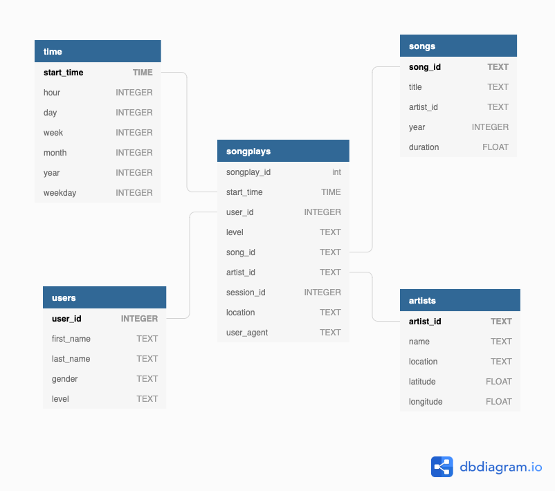

# Project: Data Modeling with Postgres


## Introduction
A music streaming startup, Sparkify, has grown their user base and song database and want to move their processes and data onto the cloud. Their data resides in S3, in a directory of JSON logs on user activity on the app, as well as a directory with JSON metadata on the songs in their app.

As their data engineer, you are tasked with building an ETL pipeline that extracts their data from S3, stages them in Redshift, and transforms data into a set of dimensional tables for their analytics team to continue finding insights in what songs their users are listening to. You'll be able to test your database and ETL pipeline by running queries given to you by the analytics team from Sparkify and compare your results with their expected results.

## Project Description
In this project, I'll apply my knowledge on data warehouses and AWS to build an ETL pipeline for a database hosted on Redshift. To complete the project, I will need to load data from S3 to staging tables on Redshift and execute SQL statements that create the analytics tables from these staging tables.

# Getting Started

## Project Datasets
You'll be working with two datasets that reside in S3. Here are the S3 links for each:

Song data: `s3://udacity-dend/song_data`

Log data: `s3://udacity-dend/log_data`

Log data json path: `s3://udacity-dend/log_json_path.json`


## Song Dataset
The first dataset is a subset of real data from the Million Song Dataset. Each file is in JSON format and contains metadata about a song and the artist of that song. The files are partitioned by the first three letters of each song's track ID. For example, here are filepaths to two files in this dataset.

`song_data/A/B/C/TRABCEI128F424C983.json`

`song_data/A/A/B/TRAABJL12903CDCF1A.json`

And below is an example of what a single song file, TRAABJL12903CDCF1A.json, looks like.

`{"num_songs": 1, "artist_id": "ARJIE2Y1187B994AB7", "artist_latitude": null, "artist_longitude": null, "artist_location": "", "artist_name": "Line Renaud", "song_id": "SOUPIRU12A6D4FA1E1", "title": "Der Kleine Dompfaff", "duration": 152.92036, "year": 0}`

## Log Dataset
The second dataset consists of log files in JSON format generated by this event simulator based on the songs in the dataset above. These simulate app activity logs from an imaginary music streaming app based on configuration settings.

The log files in the dataset you'll be working with are partitioned by year and month. For example, here are filepaths to two files in this dataset.

`log_data/2018/11/2018-11-12-events.json`

`log_data/2018/11/2018-11-13-events.json`

And below is an example of what the data in a log file, 2018-11-12-events.json, looks like.


## Schema for Song Play Analysis

Using the song and event datasets, you'll need to create a star schema optimized for queries on song play analysis. This includes the following tables.

### Fact Table
1. *songplays* - records in event data associated with song plays i.e. records with page NextSong
songplay_id, start_time, user_id, level, song_id, artist_id, session_id, location, user_agent


### Dimension Tables
2. *users* - users in the app
* user_id, first_name, last_name, gender, level


3. *songs* - songs in music database
* song_id, title, artist_id, year, duration


4. *artists* - artists in music database
* artist_id, name, location, lattitude, longitude


5. *time* - timestamps of records in songplays broken down into specific units
* start_time, hour, day, week, month, year, weekday


#### Creating tables
To run the *create_tables.py* script, open a terminal window and run the following command:

```
python create_tables.py
```
#### ETL Pipeline
The *etl.py* script implements an ETL pipeline to extract data from the log files and inserts the data into the appropriate tables. 

To run the *etl.py* script, open a terminal window and run the following command:
```
python etl.py
```

#### Queries
The *sql_queries.py* script contains all of the required SQL queries and statements to create the tables and to insert data.
The *create_tables.py* and *etl.py* scripts import the SQL, so the *sql_queries.py* script does not need to run directly.


## File Description
### Song Dataset
The first dataset is a subset of real data from the Million Song Dataset. Each file is in JSON format and contains metadata about a song and the artist of that song. The files are partitioned by the first three letters of each song's track ID. For example, here are filepaths to two files in this dataset.

`
song_data/A/B/C/TRABCEI128F424C983.json
song_data/A/A/B/TRAABJL12903CDCF1A.json
`

And below is an example of what a single song file, TRAABJL12903CDCF1A.json, looks like.


```json
{"num_songs": 1, "artist_id": "ARJIE2Y1187B994AB7", "artist_latitude": null, "artist_longitude": null, "artist_location": "", "artist_name": "Line Renaud", "song_id": "SOUPIRU12A6D4FA1E1", "title": "Der Kleine Dompfaff", "duration": 152.92036, "year": 0}
```

### Log Dataset
The second dataset consists of log files in JSON format generated by this event simulator based on the songs in the dataset above. These simulate activity logs from a music streaming app based on specified configurations.

The log files in the dataset you'll be working with are partitioned by year and month. For example, here are filepaths to two files in this dataset.

`
log_data/2018/11/2018-11-12-events.json
log_data/2018/11/2018-11-13-events.json
`

And below is an example of what the data in a log file, 2018-11-12-events.json, looks like.


## The ETL Process

### log_data

#### Source dataset
The log files in the dataset I'll be working with are partitioned by year and month. For example, here are filepaths to two files in this dataset.

`log_data/2018/11/2018-11-12-events.json
log_data/2018/11/2018-11-13-events.json
`

And below is an example of what the data in a log file, 2018-11-12-events.json, looks like.
```json
{
  "artist": "Pavement",
  "auth": "Logged In",
  "firstName": "Sylvie",
  "gender": "F",
  "itemInSession": 0,
  "lastName": "Cruz",
  "length": 99.16036,
  "level": "free",
  "location": "Washington-Arlington-Alexandria, DC-VA-MD-WV",
  "method": "PUT",
  "page": "NextSong",
  "registration": 1540266185796.0,
  "sessionId": 345,
  "song": "Mercy:The Laundromat",
  "status": 200,
  "ts": 1541990258796,
  "userAgent": "\"Mozilla/5.0 (Macintosh; Intel Mac OS X 10_9_4) AppleWebKit/537.77.4 (KHTML, like Gecko) Version/7.0.5 Safari/537.77.4\"",
  "userId": "10"
}
```

## Database Schema - Star Schema



- **Users**: (Dimension Table) Users records in the database
- **Songs**: (Dimension Table) Songs records in the database
- **Artists**: (Dimension Table) Artists records in the database
- **Time**: (Dimension Table) Timestamps of records in songplays broken down into specific units
- **Songplays**: (Fact Table) Records in log data format, associated with song plays


### Project: Destination Tables

- **Time** table: From dataset, I selected ts and saved the extracted the timestamp, hour, day, week of year, month, year, and weekday from the ts field.

| start_time                 | hour | day | week | month | year | weekday |
|----------------------------|------|-----|------|-------|------|---------|
| 2018-11-29 00:00:57.796000 | 0    | 29  | 48   | 11    | 2018 | 3       |
| 2018-11-29 00:01:30.796000 | 0    | 29  | 48   | 11    | 2018 | 3       |


- **Users** table: Saved user ID, first name, last name, gender and level. In case of duplicated user information, I update the level field.

| user_id | first_name | last_name | gender | level |
|---------|------------|-----------|--------|-------|
| 91      | Jayden     | Bell      | M      | free  |
| 73      | Jacob      | Klein     | M      | paid  |
| 86      | Aiden      | Hess      | M      | free  |
| 24      | Layla      | Griffin   | F      | paid  |
| 26      | Ryan       | Smith     | M      | free  |


- **Songplays** table: I saved the timestamp, user ID, level, song ID, artist ID, session ID, location, and user agent from dataset. The song ID and artist ID will be retrieved by querying the songs and artists tables to find matches based on song title, artist name, and song duration time.

| songplay_id | start_time                 | user_id | level | song_id | artist_id | session_id | location                            | user_agent                                                                                                              |
|-------------|----------------------------|---------|-------|---------|-----------|------------|-------------------------------------|-------------------------------------------------------------------------------------------------------------------------|
| 1           | 2018-11-29 00:00:57.796000 | 73      | paid  | -       | -         | 954        | Tampa-St. Petersburg-Clearwater, FL | "Mozilla/5.0 (Macintosh; Intel Mac OS X 10_9_4) AppleWebKit/537.78.2 (KHTML, like Gecko) Version/7.0.6 Safari/537.78.2" |
| 2           | 2018-11-29 00:01:30.796000 | 24      | paid  | -       | -         | 984        | Lake Havasu City-Kingman, AZ        | "Mozilla/5.0 (Windows NT 6.1; WOW64) AppleWebKit/537.36 (KHTML, like Gecko) Chrome/36.0.1985.125 Safari/537.36"         |
| 3           | 01:12:48.796000            | 73      | paid  | None    | None      | 1049       | Tampa-St. Petersburg-Clearwater, FL | "Mozilla/5.0 (Macintosh; Intel Mac OS X 10_9_4) AppleWebKit/537.78.2 (KHTML, like Gecko) Version/7.0.6 Safari/537.78.2"
| 4           |01:17:05.796000             | 73      | paid  | None    | None      | 1049       | Tampa-St. Petersburg-Clearwater, FL | "Mozilla/5.0 (Macintosh; Intel Mac OS X 10_9_4) AppleWebKit/537.78.2 (KHTML, like Gecko) Version/7.0.6 Safari/537.78.2"


- **Songs** table: I saved song ID, Title, artist id, year and duration. 

| song_id              | title                             | artist_id           | year   | duration  |
|----------------------|-----------------------------------|---------------------|--------|-----------|
| SOMZWCG12A8C13C480   | I Didn't Mean To                  | ARD7TVE1187B99BFB1  | None   | 218.93179 |
| SOUDSGM12AC9618304   | Insatiable (Instrumental Version) | ARNTLGG11E2835DDB9  | None   | 266.39628 |
| SOIAZJW12AB01853F1   | Pink World                        | AR8ZCNI1187B9A069B  | 1984   | 269.81832 |


- **Artists** table: I saved artist_id,name,location,latitude and longitude.

| artist_id          | name             | location        | latitude   | longitude  |
|--------------------|------------------|-----------------|------------|------------|
| ARD7TVE1187B99BFB1 | Casual           | California - LA | None       | None       |
| ARNTLGG11E2835DDB9 | Clp              | None            | None       | None       |
| AR8ZCNI1187B9A069B | Planet P Project | None            | None       | None       |


### Song Play Analysis - Sample Queries

-  Query the most popular user agent
```sql
SELECT user_agent, COUNT(*) agent_cnt
FROM songplays
WHERE user_agent IS NOT NULL
GROUP BY user_agent
ORDER BY 2 DESC;
````


-  Query the gender distribution
```sql
SELECT u.gender, COUNT(*) amount 
FROM users as u, songplays as s 
WHERE s.user_id = u.user_id 
AND s.user_id IS NOT NULL 
GROUP BY u.gender 
ORDER BY 2 DESC;
```


- Query the most active users
```sql
SELECT user_id, COUNT(*) activity_cnt
FROM songplays
WHERE user_id IS NOT NULL
GROUP BY user_id
ORDER BY 2 DESC;
```


- Query the most common level
```sql
SELECT level, COUNT(level) level_cnt
FROM songplays
WHERE user_id IS NOT NULL
GROUP BY level
ORDER BY 2 DESC;
```